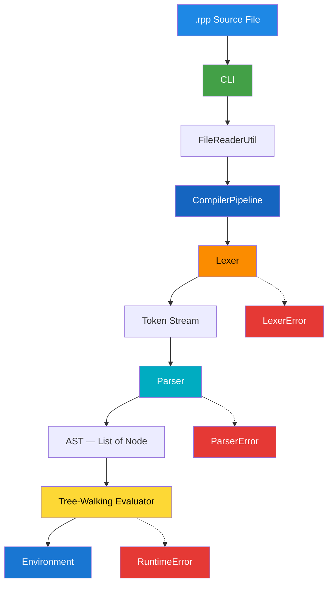

# RppLang (R++)

A custom interpreted programming language and tree-walking compiler built from scratch in Java — covering lexical analysis, recursive-descent parsing, AST generation, scoped runtime environments, and structured error reporting.


---

## Why RppLang?

R++ was built to understand how programming languages work under the hood — not by using parser generators or scripting engines, but by implementing every stage of the pipeline manually: tokenization, syntax analysis, AST construction, and interpretation.

The language uses familiar C-style syntax while the engine follows real compiler architecture patterns, making it a practical study of interpreter design.

---

## Overview

RppLang is a lightweight, interpreted language (`.rpp` files) that demonstrates core compiler and runtime concepts:

- Character-level lexical scanning with line/column tracking
- Recursive-descent parsing with operator precedence
- AST-based tree-walking evaluation
- Lexically scoped variable environments (parent chain)
- Control flow with `break` / `continue` via exception-based signaling
- Layered error handling across lexer, parser, and runtime

The goal is to explain **how a language executes internally**, not to compete with production runtimes.

---

## Features

- 📄 Source file execution via CLI
- 🔤 Custom lexer with keyword, operator, and comment recognition
- 🌳 Recursive-descent parser producing a typed AST
- 🧮 Arithmetic, comparison, and string concatenation
- 🔀 Conditionals with `if`, `else if`, and `else`
- 🔁 Loops — `for`, `while`, and `do-while`
- ⏭️ Loop control — `break` and `continue`
- 📦 Block-scoped variables via chained environments
- 🚨 Structured errors at lex, parse, and runtime stages
- 🏗 Modular Java package architecture

---

## Language Reference

### Statements

| Construct | Syntax | Description |
|-----------|--------|-------------|
| Variable declaration | `let name = value;` | Declares a variable; initializer optional |
| Assignment | `name = value;` | Updates an existing variable or defines in current scope |
| Output | `print(expr);` | Evaluates and prints a value |
| Conditional | `if (cond) { } else if (cond) { } else { }` | Branching with chained `else if` |
| For loop | `for (init; cond; update) { }` | C-style loop; any clause may be omitted |
| While loop | `while (cond) { }` | Pre-test loop |
| Do-while loop | `do { } while (cond);` | Post-test loop |
| Break | `break;` | Exits the innermost loop |
| Continue | `continue;` | Skips to the next loop iteration |

### Data Types

| Type | Example | Runtime Representation |
|------|---------|------------------------|
| Integer | `42` | `Integer`, `Long`, or `BigInteger` (auto-widening) |
| Float | `3.14` | `Double` |
| String | `"hello"` | `String` |
| Boolean | `true`, `false` | `Boolean` |

### Operators (by precedence, highest first)

| Level | Operators | Associativity |
|------:|-----------|---------------|
| 1 | `*`, `/` | Left |
| 2 | `+`, `-` | Left |
| 3 | `>`, `>=`, `<`, `<=` | Left |
| 4 | `==`, `!=` | Left |

`+` performs string concatenation when either operand is a string.

### Comments

```rpp
// single-line comment

/*
   multi-line comment
*/
```

---

## Architecture



### Execution Flow

1. **CLI** reads the file path and loads source via `FileReaderUtil`.
2. **Lexer** scans characters into typed `Token` objects (with line, column, and position metadata).
3. **Parser** consumes tokens and builds a `List<Node>` — the program's AST.
4. **Runtime** walks the AST: each `Node.evaluate(Environment)` executes in a global environment, creating child environments for blocks and loop bodies.

---

## Project Structure

```
RppLang
│
├── src/main/java/com/rpp/
│   ├── Main.java                 # Entry point
│   ├── cli/                      # Command-line interface
│   ├── pipeline/                 # Lexer → Parser → Runtime orchestration
│   ├── lexer/                    # Tokenizer, Token, TokenType
│   ├── parser/
│   │   ├── Parser.java           # Recursive-descent parser
│   │   └── ast/                  # AST node hierarchy (17 node types)
│   ├── runtime/
│   │   ├── Environment.java      # Scoped variable store
│   │   └── exception/            # BreakException, ContinueException
│   ├── error/                    # LexerError, ParserError, RuntimeError
│   └── io/                       # File reading utility
│
├── src/test/
│   ├── java/com/rpp/             # Test scaffolding
│   └── samples/                  # Example .rpp programs
│
├── pom.xml
├── cmd.txt                       # Manual build commands
├── LICENSE
└── README.md
```

---

## Design Deep Dive

### Lexical Analysis

The lexer performs a single-pass scan over the source string. It recognizes keywords (`let`, `print`, `if`, `for`, …), identifiers, numeric literals (integer, long, big integer, or double), string literals, operators, delimiters, and both single-line (`//`) and multi-line (`/* */`) comments. Every token carries **line**, **column**, and **index** metadata used by the error system.

### Parsing

`Parser` is a hand-written **recursive-descent** parser. Statements are parsed at the top level; expressions use a layered precedence chain (`expression` → `equality` → `comparison` → `term` → `factor`). Each syntactic construct maps directly to an AST node — there is no intermediate bytecode or IR.

### AST Evaluation

All AST nodes extend the abstract `Node` class with a single `evaluate(Environment env)` method. This **tree-walking interpreter** pattern keeps execution logic co-located with syntax structure — `IfNode` handles branching, `BinaryOpNode` handles arithmetic and comparisons, and loop nodes manage iteration.

### Scoped Environments

`Environment` is a chain of hash maps. Each `{ block }` and `for` loop body creates a child environment linked to its parent:

- `define()` — declares a variable in the current scope (throws if redeclared via `LetNode`)
- `get()` — walks up the chain to resolve a variable
- `set()` — updates in the nearest scope that already holds the name, or defines locally

This gives true block scoping — a variable declared inside a `for` loop does not leak into the outer scope.

### Loop Control Flow

`break` and `continue` are implemented using `BreakException` and `ContinueException`. Loop nodes (`ForNode`, `WhileNode`, `DoWhileNode`) catch these exceptions internally, avoiding global flags or complex state machines.

---

## Build

### Maven

```bash
git clone https://github.com/Raj-Patel7807/RppLang.git
cd RppLang

mvn compile
mvn package
```

### Manual (without Maven)

```bash
dir /s /b src\*.java > sources.txt
javac -d out @sources.txt
jar cfe rpp.jar com.rpp.Main -C out .
```

---

## Run

```bash
# Using Maven-compiled classes
java -cp target/classes com.rpp.Main src/test/samples/hello.rpp

# Using packaged JAR (after manual build)
java -jar rpp.jar src/test/samples/hello.rpp
```

---

## Example

**Input** — `src/test/samples/hello.rpp`:

```rpp
let x = 10;
let y = 100;
let z = x + y;

print("Hello, World!");
print(x + y);
print("Value of z = " + z);

let marks = 99;
if (marks >= 91) {
  print("Grade A");
} else if (marks >= 81) {
  print("Grade B");
} else {
  print("Fail");
}

for (let i = 0; i < 5; i = i + 1) {
  if (i == 3) { break; }
  print("i = " + i);
}
```

**Output:**

```
Hello, World!
110
Value of z = 110
Grade A
i = 0
i = 1
i = 2
```

---

## Error Handling

Errors are reported at three distinct stages with location metadata:

| Stage | Class | Trigger Examples |
|-------|-------|------------------|
| Lexical | `LexerError` | Unexpected character, unterminated string/comment |
| Syntax | `ParserError` | Missing semicolon, invalid statement, bad expression |
| Runtime | `RuntimeError` | Undefined variable, redeclaration, non-boolean condition |

All errors surface through `CompilerPipeline` with a unified `Error: …` message on stderr.

---

## Technologies

- Java 26
- Maven
- Hand-written recursive-descent parser
- Tree-walking AST interpreter
- Chained hash-map environments
- Exception-based loop control
- JAR packaging

---

## Key Learnings

- Designing a token stream and keyword recognition from raw characters
- Building a recursive-descent parser with operator precedence
- Mapping syntax directly to an executable AST
- Implementing lexical scoping with environment chains
- Handling non-local control flow (`break` / `continue`) in an interpreter
- Separating lex, parse, and runtime error domains
- Structuring a multi-package compiler project in Java

---

## License

This project is licensed under the MIT License — see [LICENSE](LICENSE).

---

Built by **Raj Patel** to explore compiler construction, language design, parsing theory, and interpreter internals using Java.
